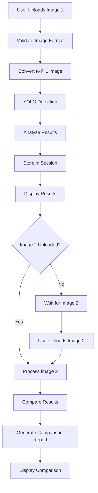
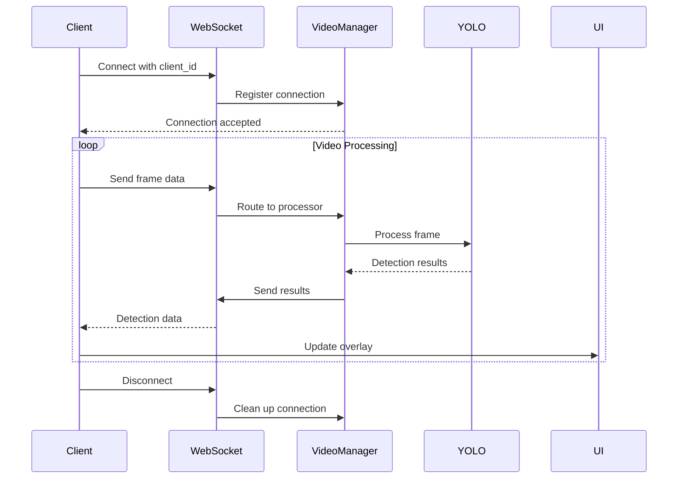
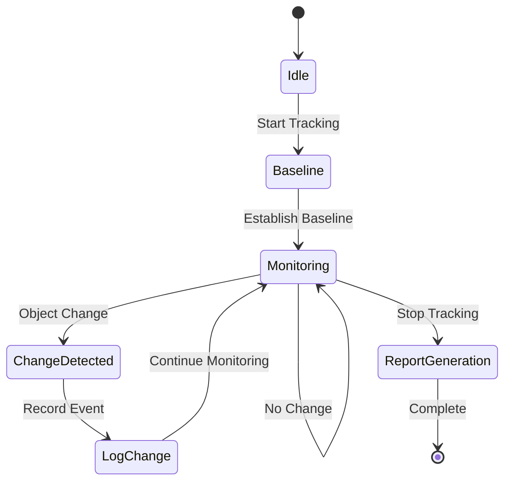

# Architecture and Workflow Documentation

## Table of Contents
1. [System Architecture Overview](#system-architecture-overview)
2. [Component Design Patterns](#component-design-patterns)
3. [Workflow Implementations](#workflow-implementations)
4. [Data Flow Architecture](#data-flow-architecture)
5. [Real-time Processing Design](#real-time-processing-design)
6. [State Management](#state-management)
7. [Scalability and Performance](#scalability-and-performance)
8. [Security Architecture](#security-architecture)

## System Architecture Overview

The Object Detection Application follows a layered microservice-inspired architecture with clear separation of concerns, enabling maintainability, testability, and scalability.

### Architectural Layers

```
┌─────────────────────────────────────────────────────────┐
│                 Presentation Layer                      │
│  ┌─────────────┐  ┌─────────────┐  ┌─────────────┐    │
│  │   HTML/CSS  │  │ JavaScript  │  │  Templates  │    │
│  │    (UI)     │  │ (Behavior)  │  │ (Structure) │    │
│  └─────────────┘  └─────────────┘  └─────────────┘    │
└─────────────────────────────────────────────────────────┘
                           │
                    HTTP/WebSocket
                           │
┌─────────────────────────────────────────────────────────┐
│                 Application Layer                       │
│  ┌─────────────┐  ┌─────────────┐  ┌─────────────┐    │
│  │   FastAPI   │  │  Routing    │  │ Middleware  │    │
│  │ Controllers │  │  Handlers   │  │   (CORS)    │    │
│  └─────────────┘  └─────────────┘  └─────────────┘    │
└─────────────────────────────────────────────────────────┘
                           │
                   Internal Function Calls
                           │
┌─────────────────────────────────────────────────────────┐
│                  Business Layer                         │
│  ┌─────────────┐  ┌─────────────┐  ┌─────────────┐    │
│  │  Detection  │  │ Comparison  │  │  Session    │    │
│  │   Service   │  │   Logic     │  │  Manager    │    │
│  └─────────────┘  └─────────────┘  └─────────────┘    │
└─────────────────────────────────────────────────────────┘
                           │
                    Model Interface
                           │
┌─────────────────────────────────────────────────────────┐
│                   Model Layer                           │
│  ┌─────────────┐  ┌─────────────┐  ┌─────────────┐    │
│  │   YOLO11x   │  │   OpenCV    │  │    PIL      │    │
│  │   Model     │  │ Processing  │  │ Operations  │    │
│  └─────────────┘  └─────────────┘  └─────────────┘    │
└─────────────────────────────────────────────────────────┘
```

### Core Architectural Principles

#### 1. Single Responsibility Principle
Each component has a specific, well-defined responsibility:
- **ObjectDetectionService**: Handles all YOLO model operations
- **SessionManager**: Manages user session lifecycle
- **VideoProcessingManager**: Handles real-time WebSocket connections

#### 2. Dependency Injection Pattern
```python
# Services are injected as singletons
detection_service = ObjectDetectionService()
session_manager = SessionManager()
video_manager = VideoProcessingManager()

# Endpoints receive services as dependencies
@app.post("/detect/{image_number}")
async def detect_objects_numbered(
    # Dependencies are available globally
    detection_service=detection_service,
    session_manager=session_manager
):
```

#### 3. Observer Pattern (WebSocket)
```python
class VideoProcessingManager:
    def __init__(self):
        self.active_connections: Dict[str, WebSocket] = {}
        # Observers (WebSocket clients) register/unregister
    
    async def notify_all(self, message: Dict):
        # Notify all registered observers
        for client_id, websocket in self.active_connections.items():
            await websocket.send_json(message)
```

## Component Design Patterns

### 1. Service Layer Pattern

#### ObjectDetectionService Architecture
```python
class ObjectDetectionService:
    """
    Encapsulates all YOLO-related operations
    Follows the Service Layer pattern for business logic isolation
    """
    
    def __init__(self):
        self.model = None
        self.model_name = "yolo11x.pt"
        self.load_model()  # Eager loading
    
    # Core detection pipeline
    def detect_objects(self, image, params) -> Results
    def analyze_detections(self, results) -> Tuple[List, Dict]
    def create_detection_report(self, detections, class_counts, name) -> Dict
    
    # Comparison operations
    def compare_images(self, det1, counts1, det2, counts2) -> Dict
    
    # Real-time processing
    def process_video_frame(self, frame_data, params) -> Dict
```

#### Design Benefits
- **Testability**: Each method can be unit tested independently
- **Reusability**: Service methods can be called from multiple endpoints
- **Maintainability**: YOLO logic is centralized in one place

### 2. Factory Pattern for Model Loading

```python
class ModelFactory:
    @staticmethod
    def create_model(model_type: str):
        models = {
            'yolo11n': lambda: YOLO('yolo11n.pt'),   # Fast, mobile-friendly
            'yolo11s': lambda: YOLO('yolo11s.pt'),   # Small
            'yolo11m': lambda: YOLO('yolo11m.pt'),   # Medium
            'yolo11l': lambda: YOLO('yolo11l.pt'),   # Large
            'yolo11x': lambda: YOLO('yolo11x.pt'),   # Extra large (default)
        }
        
        if model_type not in models:
            raise ValueError(f"Unsupported model type: {model_type}")
        
        return models[model_type]()

# Usage
detection_service.model = ModelFactory.create_model('yolo11x')
```

### 3. Builder Pattern for Detection Parameters

```python
class DetectionParametersBuilder:
    def __init__(self):
        self.params = {
            'conf': 0.50,
            'iou': 0.15,
            'imgsz': 640,
            'max_det': 500,
            'show_labels': True,
            'show_conf': False,
            'agnostic_nms': True
        }
    
    def confidence(self, conf: float):
        self.params['conf'] = conf
        return self
    
    def iou_threshold(self, iou: float):
        self.params['iou'] = iou
        return self
    
    def max_detections(self, max_det: int):
        self.params['max_det'] = max_det
        return self
    
    def build(self) -> Dict:
        return self.params

# Usage
params = (DetectionParametersBuilder()
    .confidence(0.3)
    .iou_threshold(0.25)
    .max_detections(1000)
    .build())
```

### 4. Strategy Pattern for Different Processing Modes

```python
from abc import ABC, abstractmethod

class ProcessingStrategy(ABC):
    @abstractmethod
    def process(self, image, params):
        pass

class StaticImageStrategy(ProcessingStrategy):
    def process(self, image, params):
        # High-quality processing for static images
        return model.predict(
            source=image,
            imgsz=640,
            conf=params['conf'],
            # ... other high-quality parameters
        )

class RealTimeStrategy(ProcessingStrategy):
    def process(self, image, params):
        # Optimized for real-time processing
        return model.predict(
            source=image,
            imgsz=416,  # Smaller for speed
            conf=params['conf'],
            half=True,  # FP16 for speed
            # ... other speed-optimized parameters
        )

# Context
class DetectionContext:
    def __init__(self, strategy: ProcessingStrategy):
        self.strategy = strategy
    
    def execute(self, image, params):
        return self.strategy.process(image, params)
```

## Workflow Implementations

### 1. Image Comparison Workflow



#### Implementation Details

##### Step 1: Image Validation and Processing
```python
async def handle_image_upload(image: UploadFile, image_number: int, session_id: str):
    # 1. Validate file type
    if not image.content_type.startswith('image/'):
        raise HTTPException(400, "Invalid file type")
    
    # 2. Read and validate image data
    image_data = await image.read()
    if len(image_data) > MAX_FILE_SIZE:
        raise HTTPException(400, "File too large")
    
    # 3. Convert to PIL Image
    pil_image = Image.open(io.BytesIO(image_data))
    if pil_image.mode != 'RGB':
        pil_image = pil_image.convert('RGB')
    
    # 4. Process through YOLO
    return await process_image_detection(pil_image, image_number, session_id)
```

##### Step 2: YOLO Processing Pipeline
```python
async def process_image_detection(pil_image: Image, image_number: int, session_id: str):
    # 1. Get detection parameters
    params = get_detection_parameters_from_request()
    
    # 2. Run YOLO inference
    results = detection_service.detect_objects(pil_image, **params)
    
    # 3. Analyze and structure results
    detections, class_counts = detection_service.analyze_detections(results)
    
    # 4. Create comprehensive report
    report = detection_service.create_detection_report(
        detections, class_counts, f"Image {image_number}"
    )
    
    # 5. Generate annotated image
    annotated_image_b64 = detection_service.get_annotated_image(pil_image, results)
    
    # 6. Store in session
    result = {
        "report": report,
        "original_image": encode_image_to_base64(pil_image),
        "annotated_image": annotated_image_b64,
        "detections": detections,
        "class_counts": class_counts,
        "parameters": params
    }
    
    session_manager.update_session(session_id, f"image{image_number}", result)
    
    return result
```

##### Step 3: Comparison Logic
```python
def compare_detection_results(session_data: Dict) -> Dict:
    image1_data = session_data["image1"]
    image2_data = session_data["image2"]
    
    comparison = detection_service.compare_images(
        image1_data["detections"],
        image1_data["class_counts"],
        image2_data["detections"],
        image2_data["class_counts"]
    )
    
    return {
        "comparison": comparison,
        "image1": image1_data,
        "image2": image2_data,
        "analysis_timestamp": time.time()
    }
```

### 2. Real-time Video Processing Workflow



#### Implementation Architecture

##### WebSocket Connection Management
```python
class VideoProcessingManager:
    def __init__(self):
        self.active_connections: Dict[str, WebSocket] = {}
        self.processing_flags: Dict[str, bool] = {}
        self.frame_queues: Dict[str, asyncio.Queue] = {}
    
    async def connect(self, websocket: WebSocket, client_id: str):
        await websocket.accept()
        self.active_connections[client_id] = websocket
        self.processing_flags[client_id] = False
        self.frame_queues[client_id] = asyncio.Queue(maxsize=5)  # Buffer limit
        
        # Start processing task for this client
        asyncio.create_task(self._process_frames_for_client(client_id))
    
    async def _process_frames_for_client(self, client_id: str):
        while client_id in self.active_connections:
            try:
                # Get frame from queue (with timeout)
                frame_data = await asyncio.wait_for(
                    self.frame_queues[client_id].get(), 
                    timeout=1.0
                )
                
                # Process frame
                result = detection_service.process_video_frame(frame_data)
                
                # Send result back to client
                await self.send_detection_result(client_id, result)
                
            except asyncio.TimeoutError:
                continue  # No frame available, check again
            except Exception as e:
                await self.send_error(client_id, str(e))
```

##### Frame Processing Optimization
```python
def process_video_frame(self, frame_data: str, **params) -> Dict:
    try:
        # 1. Decode and validate frame
        frame_bytes = self._decode_frame_data(frame_data)
        pil_image = Image.open(io.BytesIO(frame_bytes))
        
        # 2. Optimize for real-time processing
        pil_image = self._optimize_for_realtime(pil_image)
        
        # 3. Run inference with real-time parameters
        results = self.model.predict(
            source=np.array(pil_image),
            imgsz=416,          # Smaller input for speed
            conf=params.get('conf', 0.5),
            iou=params.get('iou', 0.15),
            max_det=params.get('max_det', 100),
            half=True,          # FP16 precision for speed
            verbose=False       # Disable logging for speed
        )
        
        # 4. Fast analysis (minimal processing)
        detections, class_counts = self.analyze_detections_fast(results)
        
        return {
            "success": True,
            "detections": detections,
            "class_counts": class_counts,
            "total_objects": len(detections),
            "timestamp": time.time()
        }
        
    except Exception as e:
        return {
            "success": False,
            "error": str(e),
            "timestamp": time.time()
        }

def _optimize_for_realtime(self, image: Image.Image) -> Image.Image:
    # Resize to optimize processing speed while maintaining aspect ratio
    max_size = 416
    if max(image.size) > max_size:
        ratio = max_size / max(image.size)
        new_size = tuple(int(dim * ratio) for dim in image.size)
        image = image.resize(new_size, Image.LANCZOS)
    
    return image
```

### 3. Inventory Tracking Workflow



#### Tracking State Management
```python
class InventoryTracker:
    def __init__(self, client_id: str):
        self.client_id = client_id
        self.baseline_objects = None
        self.tracking_start_time = None
        self.change_history = []
        self.last_state_hash = None
        
    def start_tracking(self, initial_detections: List[Dict]):
        """Establish baseline inventory state"""
        self.baseline_objects = self._deep_copy_detections(initial_detections)
        self.tracking_start_time = datetime.now()
        self.last_state_hash = self._generate_state_hash(initial_detections)
        
        self._log_event("TRACKING_STARTED", "Baseline established")
    
    def process_current_state(self, current_detections: List[Dict]) -> Dict:
        """Compare current state with baseline and detect changes"""
        current_hash = self._generate_state_hash(current_detections)
        
        # Only process if state has changed
        if current_hash != self.last_state_hash:
            self.last_state_hash = current_hash
            
            # Analyze changes
            changes = self._analyze_inventory_changes(
                self.baseline_objects, 
                current_detections
            )
            
            # Log significant changes
            if changes['missing'] or changes['added']:
                for item in changes['missing']:
                    self._log_event("ITEM_REMOVED", f"{item['class_name']} removed")
                
                for item in changes['added']:
                    self._log_event("ITEM_ADDED", f"{item['class_name']} added")
            
            return changes
        
        return {"missing": [], "added": []}
    
    def _analyze_inventory_changes(self, baseline: List[Dict], current: List[Dict]) -> Dict:
        """Advanced inventory change detection using object matching"""
        baseline_grouped = self._group_by_class(baseline)
        current_grouped = self._group_by_class(current)
        
        missing = []
        added = []
        
        # Find missing items
        for class_name, baseline_count in baseline_grouped.items():
            current_count = current_grouped.get(class_name, 0)
            if current_count < baseline_count:
                # Items are missing
                missing.extend(
                    baseline[:baseline_count - current_count]
                )
        
        # Find added items
        for class_name, current_count in current_grouped.items():
            baseline_count = baseline_grouped.get(class_name, 0)
            if current_count > baseline_count:
                # Items were added
                added.extend(
                    current[:current_count - baseline_count]
                )
        
        return {"missing": missing, "added": added}
```

## Data Flow Architecture

### 1. Request-Response Data Flow

```
┌─────────────┐    HTTP Request     ┌─────────────┐
│   Client    │────────────────────►│  FastAPI    │
│  Browser    │                    │  Router     │
└─────────────┘                    └─────────────┘
                                           │
                                    Route to Handler
                                           │
                                           ▼
┌─────────────┐    Session Data     ┌─────────────┐
│   Session   │◄───────────────────►│  Endpoint   │
│  Manager    │                    │  Handler    │
└─────────────┘                    └─────────────┘
                                           │
                                    Process Request
                                           │
                                           ▼
┌─────────────┐    Detection Call   ┌─────────────┐
│    YOLO     │◄───────────────────►│ Detection   │
│   Model     │                    │  Service    │
└─────────────┘                    └─────────────┘
                                           │
                                    Format Response
                                           │
                                           ▼
┌─────────────┐    JSON Response    ┌─────────────┐
│   Client    │◄───────────────────│  FastAPI    │
│  Browser    │                    │ Response    │
└─────────────┘                    └─────────────┘
```

### 2. WebSocket Data Flow

```
┌─────────────┐    Frame Data      ┌─────────────┐
│   Client    │───────────────────►│  WebSocket  │
│  (Video)    │                   │  Handler    │
└─────────────┘                   └─────────────┘
                                          │
                                   Queue Frame
                                          │
                                          ▼
┌─────────────┐    Async Process   ┌─────────────┐
│    YOLO     │◄──────────────────│   Video     │
│ Processing  │                   │  Manager    │
└─────────────┘                   └─────────────┘
                                          │
                                   Send Results
                                          │
                                          ▼
┌─────────────┐   Detection Data   ┌─────────────┐
│   Client    │◄──────────────────│  WebSocket  │
│  (Updates)  │                   │  Handler    │
└─────────────┘                   └─────────────┘
```

### 3. Session Data Management

```python
# Session data structure and lifecycle management
class SessionManager:
    def __init__(self):
        self.sessions: Dict[str, SessionData] = {}
        self.cleanup_task = None
        
    def create_session(self) -> str:
        session_id = str(uuid.uuid4())
        self.sessions[session_id] = SessionData()
        return session_id
    
    def get_session(self, session_id: str) -> Optional[SessionData]:
        return self.sessions.get(session_id)
    
    def update_session(self, session_id: str, key: str, value: Any):
        if session_id in self.sessions:
            self.sessions[session_id].update(key, value)

@dataclass
class SessionData:
    image1: Optional[DetectionResult] = None
    image2: Optional[DetectionResult] = None
    created_at: float = field(default_factory=time.time)
    last_accessed: float = field(default_factory=time.time)
    
    def update(self, key: str, value: Any):
        setattr(self, key, value)
        self.last_accessed = time.time()
```

## Real-time Processing Design

### 1. Asynchronous Processing Pipeline

```python
class AsyncDetectionPipeline:
    def __init__(self):
        self.processing_queue = asyncio.Queue(maxsize=100)
        self.result_callbacks = {}
        
    async def process_frame_async(self, client_id: str, frame_data: str, callback):
        """Non-blocking frame processing"""
        # Store callback for result delivery
        self.result_callbacks[client_id] = callback
        
        # Queue frame for processing
        await self.processing_queue.put({
            'client_id': client_id,
            'frame_data': frame_data,
            'timestamp': time.time()
        })
    
    async def _processing_worker(self):
        """Background worker for frame processing"""
        while True:
            try:
                # Get frame from queue
                frame_task = await self.processing_queue.get()
                
                # Process frame
                result = detection_service.process_video_frame(
                    frame_task['frame_data']
                )
                
                # Deliver result via callback
                client_id = frame_task['client_id']
                if client_id in self.result_callbacks:
                    await self.result_callbacks[client_id](result)
                
                # Mark task as done
                self.processing_queue.task_done()
                
            except Exception as e:
                logging.error(f"Frame processing error: {e}")
```

### 2. Performance Optimization Strategies

#### Frame Rate Control
```python
class FrameRateController:
    def __init__(self, target_fps: int = 5):
        self.target_fps = target_fps
        self.frame_interval = 1.0 / target_fps
        self.last_frame_times = {}
    
    def should_process_frame(self, client_id: str) -> bool:
        current_time = time.time()
        last_time = self.last_frame_times.get(client_id, 0)
        
        if current_time - last_time >= self.frame_interval:
            self.last_frame_times[client_id] = current_time
            return True
        
        return False
```

#### Memory Management
```python
class MemoryOptimizedProcessor:
    def __init__(self):
        self.frame_cache = LRUCache(maxsize=10)  # Limit cached frames
        
    def process_with_caching(self, frame_hash: str, process_func):
        # Check cache first
        if frame_hash in self.frame_cache:
            return self.frame_cache[frame_hash]
        
        # Process and cache result
        result = process_func()
        self.frame_cache[frame_hash] = result
        
        return result
    
    def cleanup_memory(self):
        # Force garbage collection and clear caches
        self.frame_cache.clear()
        torch.cuda.empty_cache() if torch.cuda.is_available() else None
        import gc; gc.collect()
```

## State Management

### 1. Client-Side State Management

```javascript
class StateManager {
    constructor() {
        this.state = {
            session: {
                id: null,
                initialized: false
            },
            workflow: {
                currentStep: 1,
                image1: null,
                image2: null,
                comparison: null
            },
            video: {
                isProcessing: false,
                isTracking: false,
                baseline: null,
                currentDetections: null
            },
            ui: {
                loading: false,
                errors: []
            }
        };
        
        this.subscribers = new Map();
    }
    
    // State update with notification
    setState(path, value) {
        this._setNestedProperty(this.state, path, value);
        this._notifySubscribers(path, value);
    }
    
    // Subscribe to state changes
    subscribe(path, callback) {
        if (!this.subscribers.has(path)) {
            this.subscribers.set(path, new Set());
        }
        this.subscribers.get(path).add(callback);
    }
    
    // Persist critical state to localStorage
    persistState() {
        const persistData = {
            sessionId: this.state.session.id,
            workflowStep: this.state.workflow.currentStep
        };
        localStorage.setItem('od_app_state', JSON.stringify(persistData));
    }
    
    // Restore state from localStorage
    restoreState() {
        const stored = localStorage.getItem('od_app_state');
        if (stored) {
            const data = JSON.parse(stored);
            this.setState('session.id', data.sessionId);
            this.setState('workflow.currentStep', data.workflowStep);
        }
    }
}
```

### 2. Server-Side State Consistency

```python
class StateConsistencyManager:
    """Ensures data consistency across multiple requests"""
    
    def __init__(self):
        self.state_locks = defaultdict(asyncio.Lock)
    
    async def atomic_session_update(self, session_id: str, update_func):
        """Ensure atomic updates to session data"""
        async with self.state_locks[session_id]:
            session = session_manager.get_session(session_id)
            if session:
                result = update_func(session)
                session_manager.update_session(session_id, result)
                return result
            else:
                raise SessionNotFoundError(session_id)
    
    async def validate_session_state(self, session_id: str, required_data: List[str]):
        """Validate that session has required data for operation"""
        session = session_manager.get_session(session_id)
        if not session:
            raise SessionNotFoundError(session_id)
        
        missing_data = []
        for data_key in required_data:
            if not hasattr(session, data_key) or getattr(session, data_key) is None:
                missing_data.append(data_key)
        
        if missing_data:
            raise IncompleteSessionError(session_id, missing_data)
        
        return session
```

## Scalability and Performance

### 1. Horizontal Scaling Considerations

```python
# Configuration for distributed deployment
SCALING_CONFIG = {
    'load_balancer': {
        'algorithm': 'round_robin',
        'health_check_interval': 30,
        'max_connections_per_instance': 100
    },
    'session_storage': {
        'backend': 'redis',  # For multi-instance session sharing
        'ttl': 86400,        # 24 hours
        'cluster_mode': True
    },
    'model_loading': {
        'strategy': 'lazy_loading',  # Load model on first request
        'model_cache': True,         # Cache loaded models
        'gpu_allocation': 'dynamic'  # Allocate GPU resources dynamically
    }
}

# Redis-based session manager for scaling
class RedisSessionManager(SessionManager):
    def __init__(self, redis_client):
        self.redis = redis_client
        self.local_cache = LRUCache(maxsize=100)
    
    def get_session(self, session_id: str) -> Optional[Dict]:
        # Check local cache first
        if session_id in self.local_cache:
            return self.local_cache[session_id]
        
        # Fallback to Redis
        session_data = self.redis.get(f"session:{session_id}")
        if session_data:
            data = json.loads(session_data)
            self.local_cache[session_id] = data
            return data
        
        return None
    
    def update_session(self, session_id: str, key: str, value: Any):
        session_data = self.get_session(session_id) or {}
        session_data[key] = value
        
        # Update both cache and Redis
        self.local_cache[session_id] = session_data
        self.redis.setex(
            f"session:{session_id}",
            86400,  # 24 hours TTL
            json.dumps(session_data, default=str)
        )
```

### 2. Performance Monitoring and Metrics

```python
class PerformanceMonitor:
    def __init__(self):
        self.metrics = {
            'request_count': 0,
            'average_response_time': 0,
            'model_inference_times': [],
            'memory_usage': [],
            'gpu_utilization': []
        }
    
    def track_request(self, endpoint: str, response_time: float):
        self.metrics['request_count'] += 1
        
        # Update moving average
        current_avg = self.metrics['average_response_time']
        count = self.metrics['request_count']
        new_avg = ((current_avg * (count - 1)) + response_time) / count
        self.metrics['average_response_time'] = new_avg
    
    def track_inference_time(self, inference_time: float):
        self.metrics['model_inference_times'].append(inference_time)
        
        # Keep only last 100 measurements
        if len(self.metrics['model_inference_times']) > 100:
            self.metrics['model_inference_times'].pop(0)
    
    def get_performance_summary(self) -> Dict:
        inference_times = self.metrics['model_inference_times']
        
        return {
            'total_requests': self.metrics['request_count'],
            'avg_response_time': self.metrics['average_response_time'],
            'avg_inference_time': sum(inference_times) / len(inference_times) if inference_times else 0,
            'max_inference_time': max(inference_times) if inference_times else 0,
            'min_inference_time': min(inference_times) if inference_times else 0
        }
```

## Security Architecture

### 1. Input Validation and Sanitization

```python
class InputValidator:
    @staticmethod
    def validate_image_upload(file: UploadFile) -> bool:
        # Check file type
        allowed_types = {'image/jpeg', 'image/png', 'image/jpg', 'image/webp'}
        if file.content_type not in allowed_types:
            raise ValidationError("Invalid file type")
        
        # Check file size
        if file.size > 50 * 1024 * 1024:  # 50MB limit
            raise ValidationError("File too large")
        
        # Validate file header (magic bytes)
        file.file.seek(0)
        header = file.file.read(8)
        file.file.seek(0)
        
        if not InputValidator._is_valid_image_header(header):
            raise ValidationError("Invalid image file")
        
        return True
    
    @staticmethod
    def validate_detection_parameters(params: Dict) -> Dict:
        validated = {}
        
        # Confidence threshold validation
        conf = params.get('conf_threshold', 0.5)
        if not (0.05 <= conf <= 0.95):
            raise ValidationError("Confidence threshold must be between 0.05 and 0.95")
        validated['conf_threshold'] = float(conf)
        
        # IoU threshold validation
        iou = params.get('iou_threshold', 0.15)
        if not (0.1 <= iou <= 0.9):
            raise ValidationError("IoU threshold must be between 0.1 and 0.9")
        validated['iou_threshold'] = float(iou)
        
        # Max detection validation
        max_det = params.get('max_detection', 500)
        if not (10 <= max_det <= 2000):
            raise ValidationError("Max detections must be between 10 and 2000")
        validated['max_detection'] = int(max_det)
        
        return validated
```

### 2. Rate Limiting Implementation

```python
class RateLimiter:
    def __init__(self):
        self.request_counts = defaultdict(lambda: defaultdict(int))
        self.last_reset = defaultdict(lambda: defaultdict(float))
    
    def check_rate_limit(self, client_ip: str, endpoint: str, limit: int, window: int) -> bool:
        current_time = time.time()
        
        # Reset counter if window has passed
        if current_time - self.last_reset[client_ip][endpoint] > window:
            self.request_counts[client_ip][endpoint] = 0
            self.last_reset[client_ip][endpoint] = current_time
        
        # Check if under limit
        if self.request_counts[client_ip][endpoint] < limit:
            self.request_counts[client_ip][endpoint] += 1
            return True
        
        return False

# Middleware implementation
@app.middleware("http")
async def rate_limiting_middleware(request: Request, call_next):
    client_ip = request.client.host
    endpoint = request.url.path
    
    # Define rate limits per endpoint
    rate_limits = {
        '/create-session': (10, 60),      # 10 per minute
        '/detect/': (30, 60),             # 30 per minute
        '/ws/video/': (5, 60)             # 5 connections per minute
    }
    
    # Check rate limit
    for path, (limit, window) in rate_limits.items():
        if endpoint.startswith(path):
            if not rate_limiter.check_rate_limit(client_ip, path, limit, window):
                raise HTTPException(429, "Rate limit exceeded")
    
    response = await call_next(request)
    return response
```

---

This architecture documentation provides a comprehensive view of the system design, implementation patterns, and scalability considerations. It serves as a technical guide for developers working on the project and demonstrates the thoughtful design decisions that make the application robust and maintainable.
